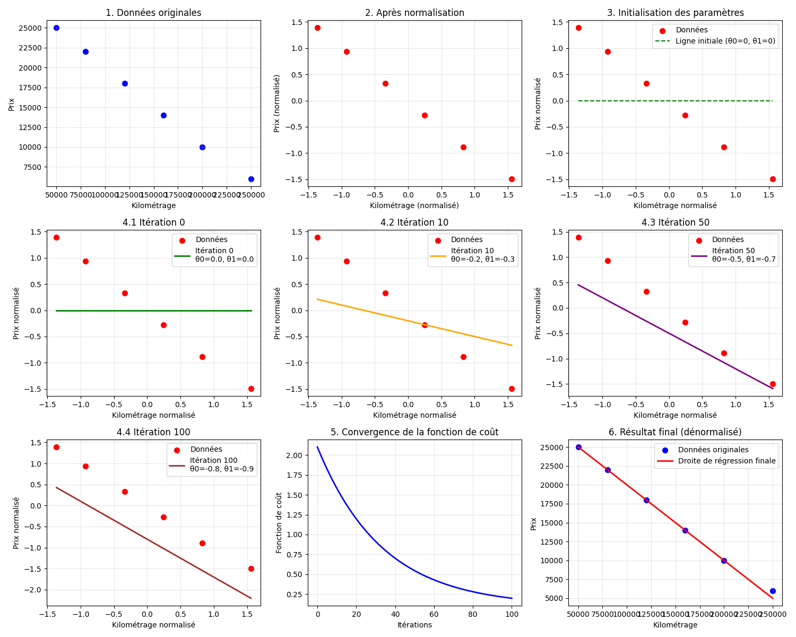
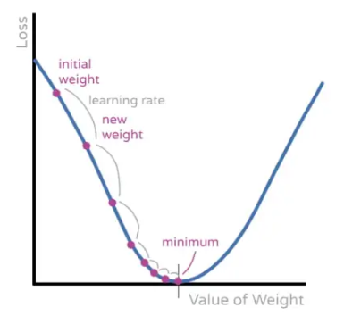
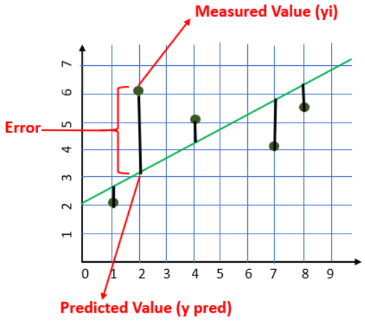

# Ft_linear_regression


## Goal
Implement a linear regression to predict car prices based on mileage.

## Key Features to Implement:

### Program training.py:
1. Loads the data from the data.csv dataset that contains mileages and their associated prices.
2. Normalizes the mileages and prices extracted from the dataset to accelerate the convergence of 
the gradient descent (= the convergence between the thetas used to make the linear regression and 
the lowest cost function). The normalization process ensures that all data points on a similar scale and therefore alows to 
use a single learning rate for both thetas.
3. Applies the gradient descent algorithm. Returns the thetas (thetas[0] -> b, thetas[1] -> w) that reduce the cost function as much as possible. 
4. De-normalizes the thetas.
5. Plots the dataset's dots and the linear regression based on the formula: **price = w * mileage + b**
6. Saves the thetas into thetas.json to be able to use them when running prediction.py

### Program prediction.py:
1. Prompts the user for a mileage input.
2. Loads the thetas' values from the thetas.json file created by training.py
3. Outputs the predicted price by applying the linear regression formula.
4. Plots the predicted price on the linear regression as well as the dataset's dots.

### Explanation graphs:




## Installation

To set up this project locally, follow these steps:

1. **Clone the repository to your local machine:**
	```sh
	git clone git@github.com:casomarr/42-ft_linear_regression.git
	```

2. **Navigate to the project directory:**
	```sh
	cd 42-ft_linear_regression
	```

3. **Train the model from dataset:**
	```sh
	python3 training.py
	```

4. **Run the prediction program:**
	```sh
	python3 prediction.py
	```

5. **Enter a given mileage to get the predicted price:**
	```sh
	Enter a mileage: 100000
	Estimated price : 6352.067977821998$
	```

